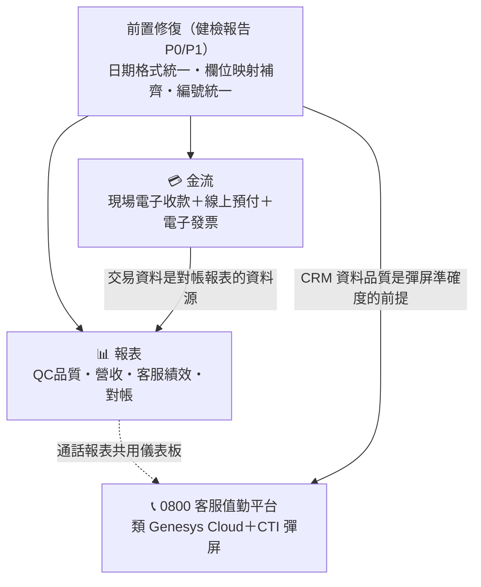
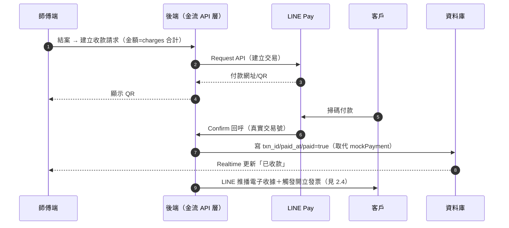
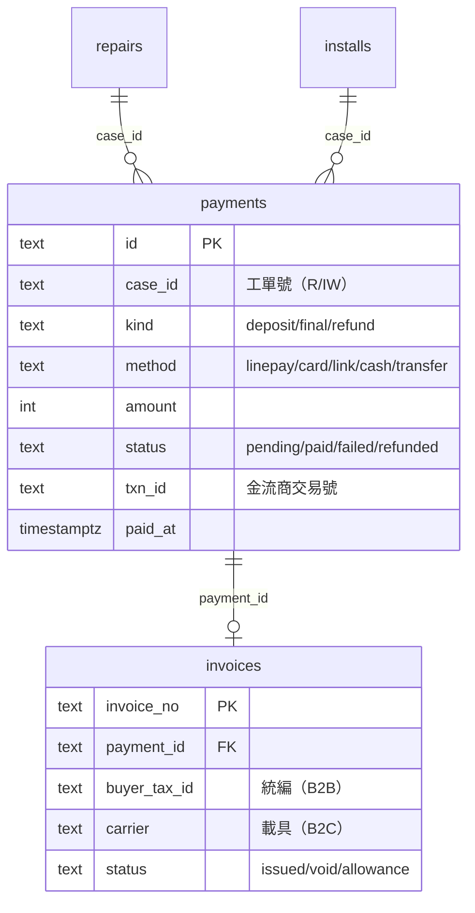
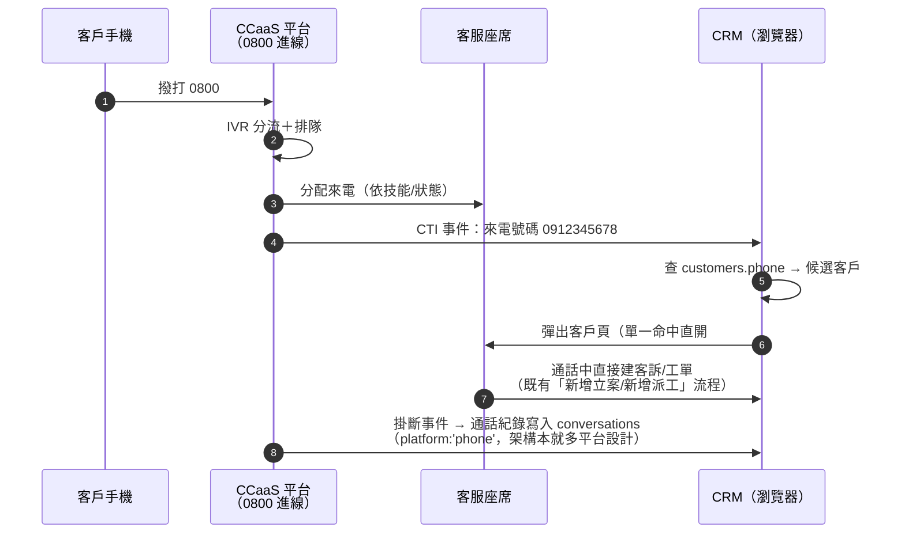
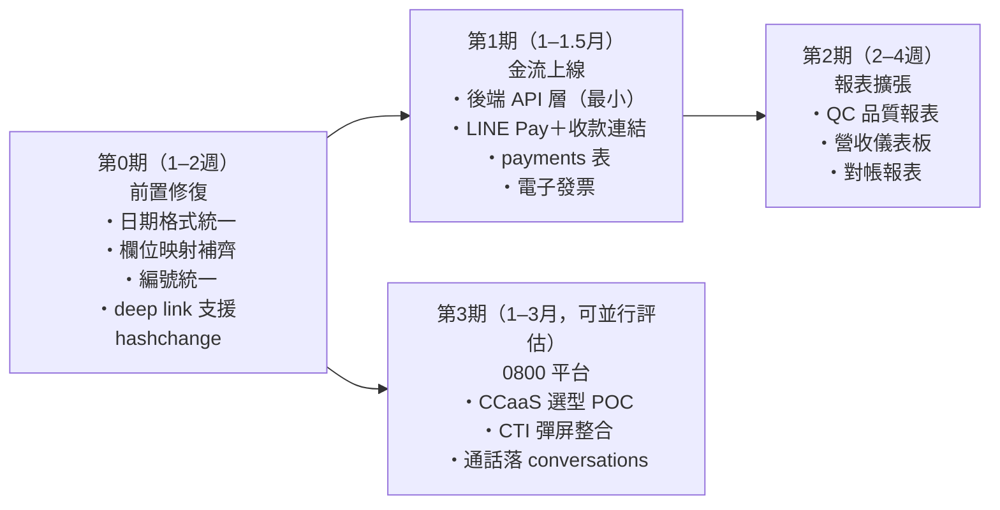

# 計畫書 2：擴張藍圖——金流・報表・0800 客服值勤平台

> **定位**：對內立項＋對廠商說明需求範圍。三大擴張各自的目標、現況落差、方案選項、與既有系統的串接點、分期建議。
> **前置閱讀**：[計畫書1：系統健檢報告](計畫書1_系統健檢報告.md)（部分擴張有前置修復依賴）｜[計畫書3：系統架構打包](計畫書3_系統架構打包.md)（現況架構）
> 版本：v1.0（2026-07-03）

---

## 1. 總覽：三大擴張的相依關係

**建議順序與理由**：
1. **前置修復先行**——日期格式（M/D/YYYY）不統一，所有對帳/月結報表都會重踩已發生過的 bug；欄位映射不補齊，金流交易資料有被舊值覆寫的風險。
2. **金流第二**——`mockPayment` 的串接點已預留（設計時就寫明「之後串真 API 只改這裡」），欄位（txn_id/paid_at/payment_method/paid）已上線並驗證過讀寫，是三者中離完成最近的。
3. **報表第三**——收費品項、QC 三階段、師傅報表的基礎都已存在，擴張是「加維度」而非「從零建」；等金流上線後對帳報表才有真實交易資料。
4. **0800 最後**——建置週期最長、依賴外部電信/CCaaS 廠商，且彈屏價值取決於 CRM 資料品質（電話號碼正確率、客編歸戶完整度），讓前面的資料治理先到位。

---

## 2. 金流

### 2.1 現況與串接點

- 目前為**模擬交易**：師傅結案時選付款方式（現金/轉帳/刷卡/免費）→ `mockPayment()` 產生虛擬交易編號 → 寫入 `txn_id`/`paid_at`/`payment_method`/`paid`。不會真的收錢，靠人工對帳。
- **串接點已預留**：`mockPayment` 函式（CRM 與師傅端各一份）的註解明載「之後串真 API 只改這裡」；資料庫欄位已於正式環境驗證讀寫（`supabase_payment.sql`）。
- 收費品項明細（品名×數量×單價＋贈品）已結構化儲存（`charges` JSONB），發票品項可直接取用。

### 2.2 範圍 A：師傅現場電子收款

**目標**：客戶現場掃碼/感應付款，系統自動對帳，消除師傅代收現金的遺失與對帳成本。

| 方案 | 形式 | 費率概況 | 師傅端改動 | 對帳 |
|------|------|---------|-----------|------|
| LINE Pay（B2C 高綁定率） | 結案畫面產生付款 QR，客戶 LINE 掃碼 | 約 2.2–3% | 結案流程加「產生付款碼」步驟，輪詢/回呼確認入帳後才寫 paid=true | API 回傳交易號自動入帳 |
| 收款連結（藍新/綠界） | 產生付款連結推播到客戶 LINE（信用卡/ATM/超商） | 約 2–2.8%＋固定費 | 最小——沿用既有 LINE 推播機制發連結 | Webhook 回寫 txn_id |
| 行動刷卡機（mPOS） | 實體卡感應 | 約 1.5–2.5%＋機具 | 需配發機具與 SOP，系統靠人工/半自動核銷 | 較弱，需匯入對帳檔 |
| 台灣 Pay/TWQR | 靜態/動態 QR | 低費率 | 中 | 依收單行 |

**建議**：LINE Pay＋收款連結雙軌起步（皆純線上、無機具成本、與現有 LINE 推播管線天然契合），刷卡機視客群年齡層需求後補。

**流程改造（以 LINE Pay 為例）**：

**關鍵設計要求（給廠商）**：
- 金流一定要有**後端 API 層**——目前前端直連資料庫的架構絕不可延伸到金流（金鑰保護、回呼驗證都做不到）。這與《內網遷移規格需求書》的 API 層要求一致，金流是最強的推力。
- `paid=true` 只能由金流回呼寫入，不可由前端自行宣告（現制 mockPayment 是前端直接寫，重建時要收權）。
- 未付款/付款失敗/現金 fallback 三種路徑都要有明確狀態，不能只有 paid 布林（建議獨立 `payments` 交易表，一張工單可多筆交易：訂金＋尾款＋退款）。

### 2.3 範圍 B：線上預付/訂金（報修檢測費）

**目標**：LINE 報修流程中先收檢測費/訂金，降低放鳥率（bomber 問題系統裡已有 `flag_bomber` 欄位，證明這是真實痛點）。

- 流程：LINE 報修 → 客服建單 → 系統發付款連結 → 付款完成才排入派工池（或未付款單標記低優先）。
- 需要新增：訂金金額規則（固定檢測費或依型號）、**退款流程**（到場後折抵/客戶取消退款/超時未付自動關單）。
- 資料模型：`payments` 表的交易型別欄（deposit/final/refund），工單關聯多筆交易。

### 2.4 範圍 C：電子發票

**目標**：收款完成自動開立電子發票，B2C 存載具、B2B 打統編。

| 項目 | 內容 |
|------|------|
| 加值中心選項 | ezPay（藍新系）、綠界、光貿——若金流選藍新/綠界，發票用同家可共用對帳後台 |
| B2C | 手機條碼載具/會員載具/捐贈碼；LINE 流程中請客戶輸入載具 |
| B2B | 統編＋抬頭（客訴/工單資料現已有公司名遮罩處理經驗，欄位要新增） |
| 品項來源 | `charges` JSONB 直接轉發票品項（品名/數量/單價已結構化） |
| 作廢/折讓 | 退款流程（2.3）必須連動發票折讓，這是最容易漏的環節 |
| 資料模型 | 新增 `invoices` 表（發票號/狀態/載具/開立時間/關聯 payment） |

### 2.5 金流資料模型建議

> 現行的工單內嵌欄位（payment_method/paid/txn_id/paid_at）保留為「最新一筆交易快照」供卡片顯示，完整交易史走 payments 表——兼顧相容與擴充。

---

## 3. 報表

### 3.1 現況（已完成的基礎）

- **師傅報表**（師傅端「我的報表」＋CRM 管理端）：月案件數、應收帳款（已收/待收）、平均處理時效（報修→結案）、型號故障率排行、未收款清單、工單細項。
- **QC 三階段資料**：每筆結案有 型號/故障原因大類/細項/處理過程 的結構化資料——這正是為品質報表設計的。
- **教訓已知**：報表曾因日期格式問題整月篩不到資料——**日期格式統一是所有新報表的前置**（健檢報告 P1）。

### 3.2 擴張範圍

| 報表 | 內容 | 資料就緒度 |
|------|------|:---:|
| **QC 品質報表** | 型號×故障原因交叉統計、月趨勢、Top 故障零件（給品管改善產品） | ✅ 資料已在收，只差呈現 |
| **營收儀表板** | 日/月營收、保內外佔比、收款方式分佈、應收帳齡 | 🟡 金流上線後才有真實數據 |
| **對帳報表** | 金流商入帳 vs 系統應收、發票狀態、退款折讓 | ❌ 依賴金流（§2） |
| **客服績效** | 對話回覆時效、建單量、客訴結案率、追蹤逾期 | 🟡 conversations 有時間戳，需補「誰回的」歸屬 |
| **B2B 建案請款** | 建案分段安裝進度×分段請款（billings 表已預留） | 🟡 表已建、流程未定（等內部 B2B 流程確認） |
| **派工使用率** | 師傅時段利用率（bookings 佔格率）、區域負載 | ✅ bookings 資料完整 |

### 3.3 技術建議（給廠商）

- 現行報表是「前端全量拉資料＋瀏覽器計算」——資料量成長後不可行。重建時報表要走**後端聚合查詢**（SQL view / materialized view），前端只拿結果。
- 儀表板優先做「每天會看」的三張：營收日報、待收款清單、QC 型號故障排行。其餘按需求排。

---

## 4. 0800 客服值勤平台

### 4.1 目標描述

打造類 **Genesys Cloud** 等級的客服值勤能力：

| 能力 | 說明 |
|------|------|
| 話務基本功 | 接聽、轉接（盲轉/諮詢轉）、保留、外撥、話後處理（ACW） |
| IVR | 「保固查詢請按1、報修請按2…」語音選單分流 |
| 排隊與溢流 | 等待音樂、排隊位置播報、忙線溢流到手機/語音信箱 |
| 錄音 | 全程錄音、依案件關聯回放（稽核與糾紛依據） |
| 人員狀態管控 | 值勤/小休/會議/離線；登入登出打卡；即時座席看板 |
| 報表管控 | 接通率、平均等待、平均處理時長（AHT）、放棄率、服務水準（SLA）、個人績效 |
| **CTI 來電彈屏** | 來電號碼→查客戶→自動彈出 CRM 客戶頁＋歷史案件 |

### 4.2 CTI 彈屏：與既有系統的天然接點

這是整合成本最低、價值最高的一環，因為現有系統已具備兩個關鍵零件：

1. **`customers.phone` 可反查客編**（注意：電話非唯一——同號可能對到多個住所，彈屏要做「候選清單」而非直接跳單一客戶，這是本系統已踩過並內化的領域知識）。
2. **Hash deep link `#crm/{wfId}` 就是現成的彈屏 URL**——CCaaS 平台的 screen-pop 設定填這個 URL 模式即可。
   - ⚠️ 前置修復：目前 deep link 只在頁面載入時解析一次（健檢報告 §3-4），常駐開著的客服畫面收到第二通來電不會跳轉，需改為監聽 hashchange。

**通話紀錄落地**：`conversations` 表的 `platform` 欄位目前有 line/facebook/instagram——加 `phone` 型別即可讓 0800 通話與 LINE/FB/IG 訊息出現在**同一個客戶時間軸**，這是現有多平台架構的自然延伸，不需要新表。

### 4.3 方案比較

| 方案 | 代表 | 建置時間 | 成本結構 | CTI 開放性 | 適合 |
|------|------|:---:|------|:---:|------|
| **國際 CCaaS** | Genesys Cloud、Amazon Connect、Five9 | 1–3 月 | 座席月租（Genesys 約 USD 75–155/席/月；Connect 按分鐘計費） | API 完整 | 要完整功能與擴充性 |
| **台灣本地雲總機/客服雲** | 台灣大哥大企業客服雲、遠傳、本地系統商（如 Asia Pacific Telecom 系） | 1–2 月 | 月租較低、0800 門號申請同窗口 | 依廠商，需確認 screen-pop API | 座席少（<10 席）、要中文支援與本地發票 |
| **開源自建** | FreePBX/Asterisk＋自寫座席面板 | 3–6 月 | 硬體＋SIP trunk＋工程人力 | 全自控 | 不建議——維運人力與語音品質風險不符合現階段規模 |

**建議**：座席規模若在個位數，先評估台灣本地客服雲（0800 門號、發票、中文客服一站搞定），要求廠商 POC 驗證兩件事：① screen-pop 可帶來電號碼呼叫自訂 URL；② 通話結束事件可回寫 API（供 conversations 落地）。若本地方案 CTI 開放性不足，再上 Amazon Connect（按量計費、起步成本低）。

### 4.4 人員狀態與帳號整合

- 座席帳號應與 `crm_users` 對應（單一身分），值勤狀態在 CCaaS 管理，CRM 側欄顯示即可（不必自建狀態機）。
- 話務報表由 CCaaS 原生提供；只有「通話→案件」的轉換率報表需要自建（joins conversations platform='phone' 與工單）。

---

## 5. 分期路線圖

| 期 | 為什麼是這個順序 |
|----|----------------|
| 第0期 | 全部是健檢報告 P0/P1 項，成本低（合計約 1 週工程），不做則後面每一期都在沙地上蓋房 |
| 第1期 | 串接點已預留、離錢最近；同時逼出「後端 API 層」這個架構升級，為後續一切打地基 |
| 第2期 | 對帳報表需要第1期的真實交易資料；QC 報表可提前並行（資料已在收） |
| 第3期 | 外部依賴最重（電信/CCaaS 廠商、0800 門號申請），選型 POC 可在第1期期間並行啟動，正式整合放最後 |

---

## 6. 各期驗收要點（給廠商）

### 第0期
- [ ] 全系統業務日期欄位為 `YYYY-MM-DD`，歷史資料遷移完成且師傅報表數字與遷移前一致
- [ ] 四端欄位映射一致性：任一端修改工單後，其他端資料無遺失（提供跨端寫入測試報告）
- [ ] 客編/簽收單號單一產生來源，並發測試不重號

### 第1期（金流）
- [ ] `paid=true` 僅能由金流回呼寫入（前端無權直寫），回呼有簽章驗證
- [ ] 完整路徑各一筆實測：付款成功／付款失敗／現金 fallback／退款＋發票折讓
- [ ] 每筆交易可從工單卡片追溯到金流商後台交易號
- [ ] 發票：B2C 載具與 B2B 統編各開立一張實測

### 第2期（報表）
- [ ] 報表查詢走後端聚合（提供資料量 10 萬筆下的回應時間實測）
- [ ] 對帳報表與金流商後台月結單金額核對一致

### 第3期（0800）
- [ ] 來電→彈屏 3 秒內；電話多客戶命中時顯示候選清單（不可直接跳錯人）
- [ ] 通話紀錄（含錄音連結）出現在該客戶 CRM 時間軸
- [ ] 座席狀態報表（接通率/AHT/放棄率）可匯出
- [ ] 斷線容錯：CCaaS 掛掉時 0800 溢流到指定手機

---

## 7. 開放決策（需要內部拍板）

| # | 問題 | 影響 |
|---|------|------|
| 1 | 金流商選誰（藍新 vs 綠界 vs LINE Pay 直簽） | 費率、發票是否同家、對帳後台 |
| 2 | 檢測費/訂金收多少、哪些案件收 | 2.3 的規則設計 |
| 3 | 0800 座席規模（幾席、是否輪班） | CCaaS 選型與月費 |
| 4 | B2B 請款流程（等內部確認清單的 21 題） | billings 報表能否納入第2期 |
| 5 | 這三期由現有廠商統包，還是金流/0800 分包 | 合約與整合責任切分 |
