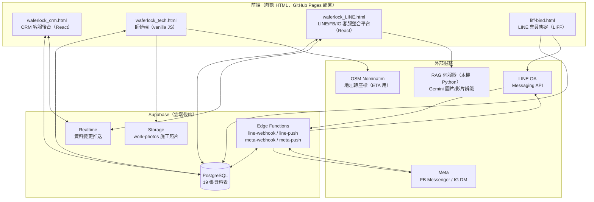
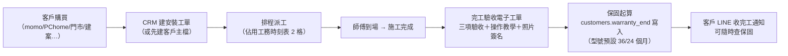
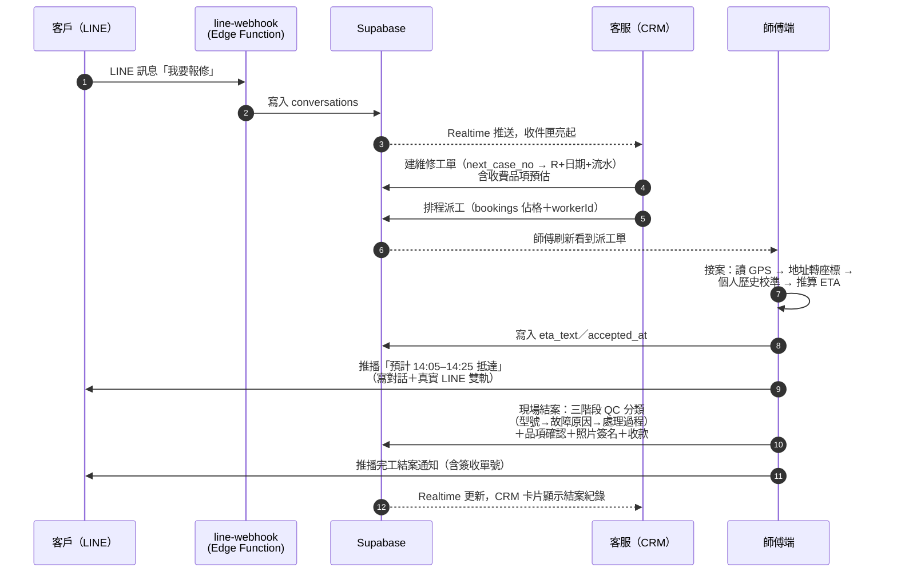
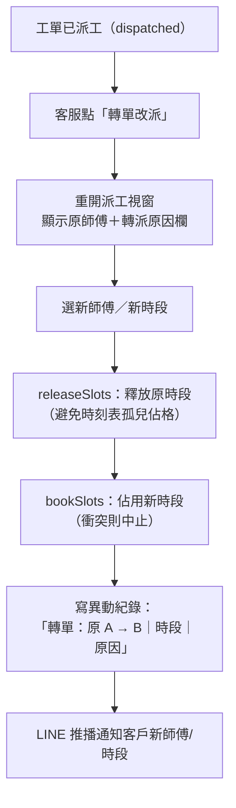
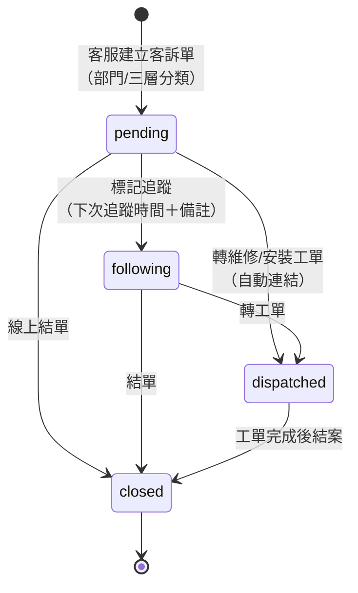
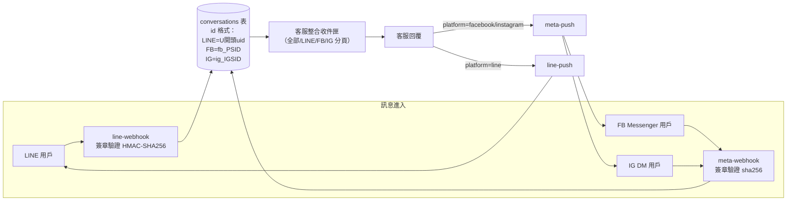
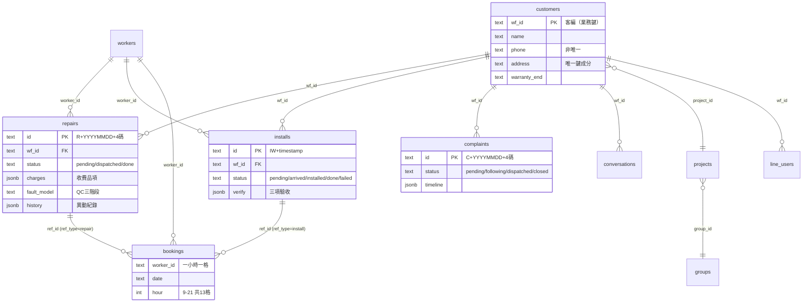

# 計畫書 3：系統架構打包文件

> **定位**：交給建置廠商的「看懂現況」文件——這套原型系統如何運作、資料怎麼流、規則長什麼樣。廠商評估與重建時以本文為地圖。
> **不包含**：資安與非功能需求（見《內網遷移規格需求書》）、現況問題清單（見[計畫書1：系統健檢報告](計畫書1_系統健檢報告.md)）、未來擴張（見[計畫書2：擴張藍圖](計畫書2_擴張藍圖_金流報表0800.md)）。
> **流程圖格式**：Mermaid（GitHub / VS Code / 任何 Markdown 編輯器可直接渲染）。
> 版本：v1.0（2026-07-03）

---

## 1. 系統全景

一句話：**四個獨立的靜態網頁前端，共用一顆 Supabase 雲端後端（PostgreSQL＋Realtime＋Storage＋Edge Functions），透過 GitHub Pages 部署，對外整合 LINE、Meta（FB/IG）、地圖服務與 AI 模型。**

**關鍵架構特徵（廠商必知）**：
- 前端**直連**資料庫（Supabase anon key），沒有中間 API 層——重建時應改為 API 層架構（詳見《內網遷移規格需求書》§5）。
- 跨端即時同步靠 Supabase Realtime（`postgres_changes` 事件）。
- 無建置工具：React 以 CDN 載入＋Babel 瀏覽器即時編譯，單檔即完整應用。

---

## 2. 角色與使用旅程

| 角色 | 使用介面 | 主要動作 |
|------|---------|---------|
| **消費者（B2C 客戶）** | LINE OA（真實）／FB Messenger／IG DM | 綁定會員、查保固、報修、收派工/完工通知 |
| **客服** | CRM 後台＋LINE 客服整合平台 | 接訊息（三平台同一收件匣）、建客訴/工單、派工排程、追蹤結案 |
| **師傅（工班）** | 師傅端（手機瀏覽器） | 接案（ETA 自動推算通知客戶）、到場/施工回報、三階段結案、拍照簽名收款、看個人月報表 |
| **QC / 主管** | CRM 後台 | 師傅報表（案件/應收/時效/型號故障率排行）、QC 三階段統計 |
| **管理員** | CRM 後台（admin 角色） | 帳號視角切換、查看照片與簽名（權限卡控）、客編歸戶整理 |

---

## 3. 核心流程圖

### 3.1 保固登錄（安裝 → 保固起算）

- 客編（WF）在**案件發生時**即發行，唯一鍵＝「正規化地址＋姓名」（電話不唯一：房東/房仲同號多住所）。
- 另有客戶 DIY 路徑：LIFF 綁定＋輸入電話 → 對到既有客戶或建新客編。

### 3.2 報修全流程（本系統最核心的一條線）

**三階段 QC 分類**（結案必填，供品質統計）：
1. 型號確認（27 型號，預帶客戶登錄型號可修正）
2. 故障原因：大類＋細項（依型號真實屬性動態組出——例如僅鋰電池機型顯示鋰電池故障、有 App 功能的機型才有連線問題類）
3. 處理過程（更換零件/排除警報/重新配對/教學/轉廠內…）

### 3.3 轉單改派（派工後改派其他師傅）

- 異動紀錄（history）區分三種：首次派工／轉單（換師傅）／改期（同師傅換時間），皆記錄操作者與時間。

### 3.4 客訴流程

- 首頁分「未處理」「待追蹤」兩區塊；客訴計數＝pending＋following。
- 追蹤動作寫入 `timeline`（JSONB），含操作者。

### 3.5 多平台訊息流（LINE / FB / IG 同一收件匣）

- 客服回覆依 `conversation.platform` 自動路由到對應推播函式。
- 客戶資訊側欄顯示該客戶的案件紀錄縮影（維修/安裝/客訴合併），每筆可深連結開 CRM 完整視圖。

---

## 4. 資料模型

### 4.1 ER 概觀（核心關聯）

### 4.2 全部 19 張表一覽

| 分類 | 表 | 用途 | 前端接線狀態 |
|------|-----|------|:---:|
| 核心 | `customers` | 客戶主檔（客編中心，含建案歸屬/座標/郵遞區號） | ✅ |
| 核心 | `repairs` | 維修工單（派工/ETA/收款/QC三階段/異動紀錄） | ✅ |
| 核心 | `installs` | 安裝工單（排程/驗收教學/收款/保固起算） | ✅ |
| 核心 | `complaints` | 客訴單（部門/三層分類/timeline） | ✅ |
| 核心 | `conversations` | 多平台對話（LINE/FB/IG，msgs JSONB） | ✅ |
| 派工 | `workers` | 工班（帳密/分區/評分） | ✅ |
| 派工 | `bookings` | 時段佔格（排程唯一真實來源，unique 防衝突） | ✅ |
| 建案 | `groups` / `projects` | 集團→建案階層（10 建商×10 建案種子資料） | ✅ |
| 帳號 | `crm_users` | 後台使用者（admin/部門角色） | ✅ |
| 設定 | `config` | 鍵值設定（wf_counter 等） | ✅ |
| 綁定 | `line_users` | LINE uid ↔ 客編 | ✅ |
| 預留 | `devices` / `device_members` | SN 裝置登錄／一鎖多人授權 | ❌ 前端未接 |
| 預留 | `shipment_stock` | 出貨庫防呆（SN 比對） | ❌ |
| 預留 | `consents` | PDPA 同意紀錄 | ❌ |
| 預留 | `billings` | B2B 分段請款 | ❌ |
| 預留 | `erp_sync` | ERP 串接 outbox | ❌ |

> 「預留」＝資料表已建好、前端功能未實作。這批表對應的是主管交辦的中期需求（SN 掃碼、PDPA、B2B 請款、ERP），重建時的資料模型應保留。

### 4.3 資料庫端邏輯

| 項目 | 說明 |
|------|------|
| `next_case_no(prefix)` RPC | 案件編號原子產號：`前綴+YYYYMMDD+4碼日流水`，每日每類重置，高併發不重號（`case_counters` 表支撐） |
| Realtime publication | 15 張表加入 `supabase_realtime`，支援跨端即時同步 |
| Storage bucket `work-photos` | 施工/簽收照片（public URL），資料表只存 URL 不存 base64 |

---

## 5. 編號與識別規則

| 識別 | 格式 | 產生方式 | 備註 |
|------|------|---------|------|
| 客編 | `WF-YYYY-nnnnn` 與 `WF+8碼` 並存 | 多軌（見健檢報告 §2.2） | ⚠️ 重建時統一 |
| 維修單 | `R20260701 0001` | next_case_no('R') | 標準 |
| 客訴單 | `C+YYYYMMDD+4碼` | next_case_no('C') | 標準 |
| 安裝單 | `IW+毫秒timestamp` | 前端產生 | ⚠️ 建議納入 RPC |
| 簽收單 | `SR...` 兩種格式 | 兩套邏輯（見健檢報告 §2.3） | ⚠️ 重建時統一 |
| 對話 id | LINE=`U...` 真實 uid／FB=`fb_PSID`／IG=`ig_IGSID` | webhook 寫入 | 前綴即平台路由依據 |
| Deep link | `#crm/{wfId}/{caseId}` | hash 路由 | 每張工單可分享直達連結；0800 彈屏可複用 |

---

## 6. 部署與整合現況

| 項目 | 現況 |
|------|------|
| 部署 | push `main` → GitHub Pages 自動部署（repo：fishchen0707-source/waferlockCRM） |
| 後端 | Supabase 雲端（URL/anon key 硬編碼於前端） |
| Edge Functions | `line-webhook`（收訊）、`line-push`（推播）、`meta-webhook`、`meta-push`——LINE 端全流程實機驗證通過；Meta 端 FB 收發驗證通過 |
| LINE | OA＋Messaging API＋LIFF 綁定＋圖文選單，實機推播驗證通過 |
| Meta | App 為**開發模式**——僅 App 角色（管理員/測試人員）訊息可觸發；正式上線需 App Review（pages_messaging） |
| AI 客服 | RAG 伺服器（Python/FastAPI＋Gemini 2.5 Flash）跑在**本機** localhost:8000，支援圖片/影片辨識門鎖型號與故障研判；正式化需部署至公開 HTTPS |
| 本機開發 | `啟動伺服器.bat`（python http.server） |

---

## 7. 已知限制與交接注意（摘要，詳見健檢報告）

1. **四端資料層手動複製**是最大結構性風險——欄位映射已漂移（LINE 端缺 27+15 欄），重建時必須改為單一資料層或 API 層。
2. 客編/簽收單號多軌產生，需統一產號機制並清理歷史格式。
3. 業務日期欄位為 `M/D/YYYY` 格式，做任何報表/對帳功能前需先統一為 ISO 格式。
4. 安全（明文密碼/RLS 全開/金鑰前端硬編碼）為原型階段已知取捨，重建時依《內網遷移規格需求書》§10–11 根治。
5. 前端有一鍵清空資料庫的「重置DB」按鈕，交接期間**請勿點擊**。

---

## 8. 附件索引

| 檔案 | 定位 |
|------|------|
| `waferlock_crm.html` | CRM 後台完整原始碼（單檔） |
| `waferlock_tech.html` | 師傅端原始碼 |
| `waferlock_LINE.html` | 多平台客服台原始碼 |
| `liff-bind.html` | LIFF 綁定頁 |
| `supabase/functions/*/index.ts` | 四支 Edge Functions 原始碼 |
| `supabase_*.sql`（11 支） | 資料表建置與遷移腳本（依版本紀錄的執行順序） |
| `專案總覽.md` | 系統架構、元件說明（開發者視角） |
| `版本紀錄.md` | 完整迭代歷程＋目前進度（單一真實來源） |
| `內網遷移規格需求書.md` | 給廠商的重建需求（資安/驗收/合約） |
| [計畫書1](計畫書1_系統健檢報告.md)／[計畫書2](計畫書2_擴張藍圖_金流報表0800.md) | 健檢與擴張藍圖 |
| `WAFERLOCK全型號知識庫_YT影片x操作手冊.xlsx` | 27 型號規格（QC 分類選單的資料來源） |
| `waferlock_all_flows.drawio` | 早期流程圖（本文件 Mermaid 版為最新） |
