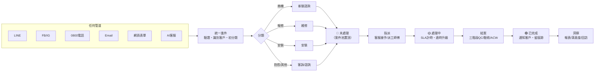
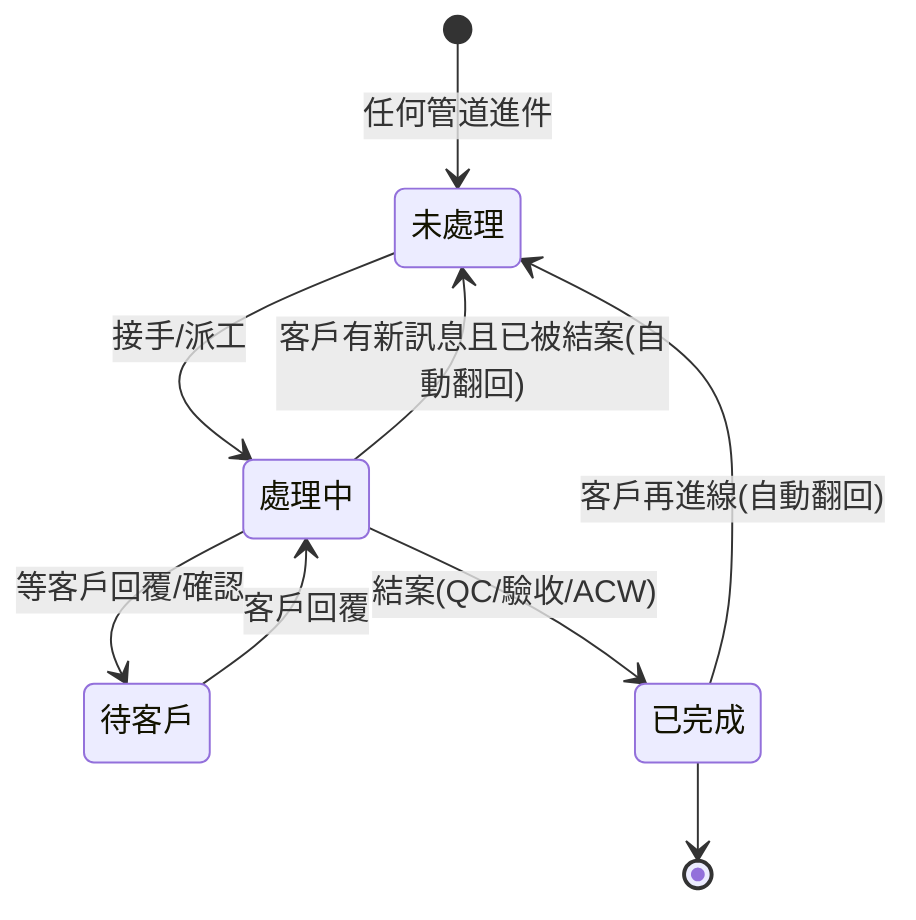
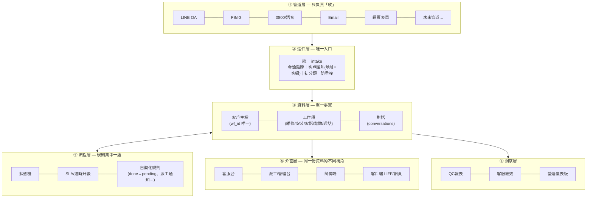

# 計畫書 4：目標架構藍圖（北極星）

> **這份文件的用途**：系統至今是「遇到需求→做一個功能」長出來的，每塊單獨都對，但塊與塊之間的縫都是事後補的。本文件把目標架構明文化成一張所有人對齊的圖——**之後每個新需求，先對照本圖回答「放哪一層」，而不是再開一支新程式**。它同時是：
> 1. 內部討論的共同語言
> 2. 聽外部廠商（Atlassian 等）簡報時的對照基準（見 §6）
> 3. 逐步收斂現有程式的路線圖（見 §5，不砍掉重練）
>
> 相關文件：[計畫書1 系統健檢](計畫書1_系統健檢報告.md)（問題明細）、[計畫書3 架構打包](計畫書3_系統架構打包.md)（現況怎麼運作）。本文寫「應該長成什麼樣」。

---

## 1. 現況診斷：拼湊感的五個來源（都有實據）

| # | 症狀 | 實據 | 後果 |
|---|------|------|------|
| 1 | **「案件」概念不統一** | 維修/安裝/客訴＝三張表、三套狀態機；通話紀錄塞在 conversations 的訊息裡；網頁商機「借」安裝單、Email「借」客訴單 | 每種新型態進來都在找地方塞；跨型態統計要各寫一次 |
| 2 | **進件管道各寫一支** | `line-webhook`、`meta-webhook`、`voicebot-tools`(電話AI)、`case-intake`(email/網頁) 各自實作「找客戶→建單→進收件匣」 | 同一段邏輯重複 4-5 份，改一個規則要改多處 |
| 3 | **前端各持一份資料映射** | `convToDb`/`repairToDb`… 在 crm.html 與 LINE.html 各一份，靠人工同步 | 已實際踩過三次「欄位漏同步」（健檢紅燈第一名） |
| 4 | **自動化規則散落三層** | 前端（`syncMsgToAgent` 的 done→pending）、資料庫 RPC（`append_conversation_message`）、Edge Function 各有規則 | 沒有一處能回答「系統目前共有哪些自動規則」 |
| 5 | **身分權限三套** | CRM 帳密（明文 PIN）、師傅端帳密、客服平台免登入只填座席名 | 資安紅燈；「誰做了什麼」在不同介面粒度不一 |

**病根**：不是工具不好，是**沒有先定義流程（業務層），就直接做功能（實作層）**。解法＝先立這張藍圖，之後有意識地收斂。

---

## 2. 核心思想：任何管道進來，都是同一張「工作項」走同一條生命週期

借 ITSM（Atlassian/ServiceNow 這類公司）的核心方法論：**一切服務請求都是 ticket**。不管從 LINE、電話、Email、網頁、還是未來的任何管道進來，系統只做一件事——生成一張工作項，走同一條路：

### 統一生命週期（狀態機）

> 這條生命週期**已經部分成真**：案件池「未處理／處理中」分區、收件匣三態＋done→pending 自動翻回，都是它的落地。缺的是讓**每一種案件型態都掛在同一條路上**，而不是各走各的。

---

## 3. 五層目標架構

### 每層的鐵律（新需求歸層判斷準則）

| 層 | 鐵律 | 反例（以後不允許） |
|---|------|------|
| ① 管道 | 只做協定轉換（LINE 簽章、Meta 簽章…），**不含業務邏輯** | webhook 裡自己寫一套找客戶建單 |
| ② 進件 | 找客戶、建客戶、建單、進收件匣**只在這裡發生一次** | 第五支管道又複製一份建單邏輯 |
| ③ 資料 | 欄位映射**單一來源**；客編唯一鍵＝地址 | 兩個 HTML 各持一份 convToDb 人工同步 |
| ④ 流程 | 自動規則集中可盤點（優先放 DB RPC/一支規則檔） | 規則散在前端、RPC、Edge Function 三處 |
| ⑤ 介面 | 只呈現與操作，**不藏業務規則** | 前端 syncMsgToAgent 裡藏狀態翻轉邏輯 |
| ⑥ 洞察 | 從統一資料自然長出，不為報表另造欄位 | 為算時效再發明第二種時間戳格式 |

---

## 4. 現有資產歸位對照表

> ✅＝已就位　🟡＝方向對但要收斂　🔴＝缺口

| 層 | 現有資產 | 狀態 | 收斂動作 |
|---|---------|------|---------|
| ①管道 | line-webhook / meta-webhook（簽章驗證） | ✅ | 保持只做協定轉換 |
| ①管道 | 0800值機桌面＋WebRTC語音＋STT | ✅ | — |
| ②進件 | **case-intake（email/網頁，已寫待部署）** | 🟡 | **它就是進件層的雛形**；下一步把 voicebot-tools 的 create_repair、webhook 的建單呼叫全部改走它（或共用同一模組） |
| ②進件 | voicebot-tools create_repair | 🟡 | 邏輯與 case-intake 重複，收斂進統一 intake |
| ③資料 | next_wf_id / next_case_no / append_conversation_message 三支 RPC | ✅ | 原子操作的正確範式，繼續唯一化 |
| ③資料 | convToDb 等映射兩檔各一份 | 🔴 | 中期抽成共用 js（單一來源）；短期靠健檢清單人工比對 |
| ③資料 | 維修/安裝/客訴三表三狀態機 | 🟡 | 不合表（工程太大），但補「統一視圖」：案件池已做的未處理/處理中就是它 |
| ④流程 | done→pending（RPC 內） | ✅ | 規則放 DB 的正確示範 |
| ④流程 | 前端藏的規則（syncMsgToAgent 等） | 🟡 | 逐步下沉到 RPC；建一份「自動規則清單.md」讓全貌可盤點 |
| ④流程 | SLA/逾時升級 | 🔴 | 缺口：未處理超過 X 小時無人接手 → 通知/升級（下一個高價值功能） |
| ⑤介面 | CustomerInfoPanel 共用、案件池分區、收件匣三態 | ✅ | 「同一資料不同視角」的正確方向 |
| ⑤介面 | 三套登入 | 🔴 | 上線前統一身分（健檢報告 P0） |
| ⑥洞察 | QC/師傅/客服績效三報表＋CSV | ✅ | — |

---

## 5. 收斂順序（絞殺者模式：不砍掉重練，動一塊歸位一塊）

1. **完成 case-intake 上線**（已寫完）→ 進件層立起第一根柱子
2. **voicebot-tools 建單改走統一 intake**（或抽共用模組）→ 進件邏輯從 4 份變 1 份
3. **建「自動規則清單.md」**：盤點散落三層的規則，之後新規則一律先登記再實作 → 流程層可盤點
4. **SLA 逾時提醒**：未處理超時 → LINE 通知主管（規則放 DB/排程）→ 流程層補最大缺口
5. **欄位映射抽共用檔**：`js/db-mapping.js` 兩個 HTML 共用 → 資料層單一來源（工程中等，排後但價值高）
6. **統一身分**（正式上線前）：至少收斂為一套帳號＋角色

> 原則：**每一步都獨立可驗收、不破壞現有功能**；新需求進來時先問「歸哪層」，順手把該層收斂一格。

---

## 6. 外部廠商簡報（Atlassian）對照用法

把簡報當**免費的架構健檢**，不是採購評估：

1. 給他們痛點調查＋這份藍圖的 §2 生命週期圖
2. 請他們畫「如果是你們，這條服務流程會怎麼設計」——**要流程圖，不是產品 demo**
3. 拿回來對照本藍圖：
   - 他們視為標配的（統一佇列、SLA、升級、知識庫掛工單）→ 我們藍圖該補強的
   - 他們支吾其詞的（**到府派工、師傅手機端、LINE、台灣金流發票**）→ 我們該保留自建的核心
4. 必問五題：①到府派工原生支援度？②LINE/金流/發票怎麼接？③師傅算不算 agent 授權、30/100 人月費？④導入期程與後續顧問費？⑤資料搬入搬出、lock-in 風險？

**預期結論**：Atlassian 強在「客服工單＋知識庫＋權限資安」半邊，弱在「到府派工＋台灣在地整合」半邊——它適合當對照組與可能的部分骨幹，不是整套答案。

---

## 7. 使用守則（讓這份文件活著）

- 新需求 → 先在本文件 §3 找歸層 → 動工時順手收斂該層一格 → 完工補 §4 對照表
- 每次外部簡報/顧問建議 → 回寫 §6 的對照心得
- 本文件與 `版本紀錄.md` 同等地位：**改架構前先讀、改完要回寫**
